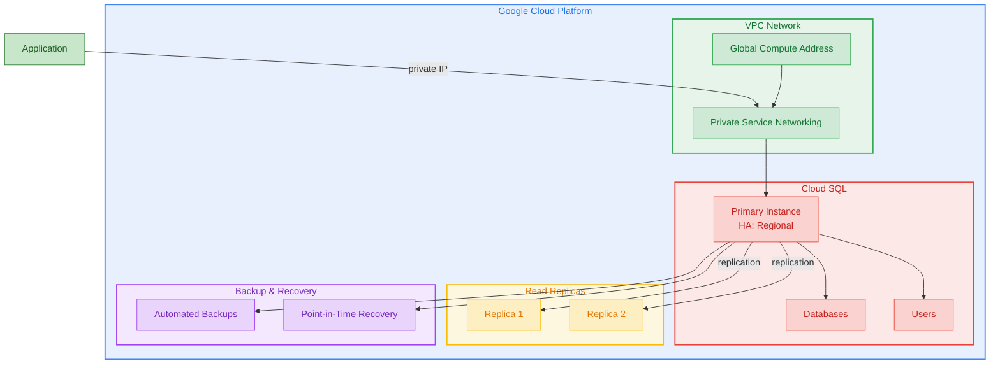

# Terraform GCP Cloud SQL

Terraform module for deploying Cloud SQL instances on Google Cloud Platform with support for PostgreSQL and MySQL, high availability, read replicas, private IP networking, and automated backups.

## Architecture



## Features

- Cloud SQL instances for PostgreSQL 15 and MySQL 8.0
- High availability with REGIONAL availability type
- Read replicas with independent sizing
- Private IP via Private Service Networking
- Automated backups with point-in-time recovery
- Configurable maintenance windows
- Query Insights for performance monitoring
- Database flags for fine-grained tuning
- Multiple databases and users per instance

## Usage

### Basic

```hcl
module "cloud_sql" {
  source = "github.com/kogunlowo123/terraform-gcp-cloud-sql"

  project_id       = "my-gcp-project"
  instance_name    = "my-postgres"
  database_version = "POSTGRES_15"

  databases = {
    "myapp" = {}
  }

  users = {
    "appuser" = { password = "change-me" }
  }
}
```

## Requirements

| Name | Version |
|------|---------|
| terraform | >= 1.5.0 |
| google | >= 5.10.0 |

## Inputs

| Name | Description | Type | Default | Required |
|------|-------------|------|---------|:--------:|
| project\_id | The GCP project ID | `string` | n/a | yes |
| instance\_name | Cloud SQL instance name | `string` | n/a | yes |
| database\_version | Database version | `string` | `"POSTGRES_15"` | no |
| tier | Machine tier | `string` | `"db-f1-micro"` | no |
| availability\_type | HA type (REGIONAL/ZONAL) | `string` | `"ZONAL"` | no |
| enable\_private\_ip | Enable private IP | `bool` | `false` | no |

## Outputs

| Name | Description |
|------|-------------|
| instance\_name | Cloud SQL instance name |
| instance\_connection\_name | Connection name |
| private\_ip\_address | Private IP address |
| public\_ip\_address | Public IP address |
| read\_replica\_names | Read replica instance names |

## License

MIT Licensed. See [LICENSE](LICENSE) for full details.
